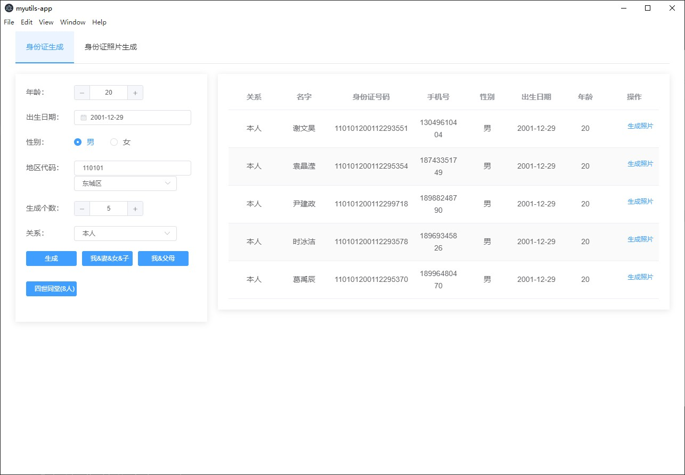

# myutils-app



练手玩具项目，我的小工具，目前实现了以下功能：

* 身份证号码生成
  * 根据年龄、性别、地区批量生成指定数量身份证号、姓名、手机号
  * 生成一家四口，夫妻+子女
  * 生成一家三口，父母+1
  * 生成四世同堂，父母+夫妻+子女+孙子/女

## 安装

### windows
[我的小工具](https://gitee.com/Pinnsvin/myutils-app/releases)

### linux

## 参与开发

### 下载项目
```bash
git clone https://gitee.com/Pinnsvin/myutils-app.git
```

### 启动项目
```bash 
yarn run electron:serve
```

### 打包
```bash
yarn run electron:build
```
